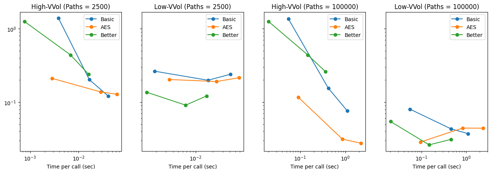

# Heston Model

In this repositary we examine a few different variations of the Heston model, for performance, accuracy, and calibration fit. All models are implemented with [Qablet MCModel Base](https://github.com/qablet-academy/intro/blob/main/notebooks/2_1_custom_mc.ipynb) so they can be used to price any Qablet timetable.

# Closed form and MC Models implemented in this repo
- [Basic Heston Model](./src/models/basic.py)
- [Closed form pricers](./src/models/closed.py) using charactertistic functions.
- [Heston Almost Exact Simulation](./src/models/aes.py).

# Notebooks

- [Heston AES](HestonAES.ipynb) with different contracts
    - Vanilla Options
    - Forward Starting Options
    - Accumulator Cliquets

- [Errors By Strike](Model%20Errors%20By%20Strike.ipynb)
- [Errors Distribution](Model%20Erros%20distribution.ipynb)
- [Plot RMSE vs Exec Time](Model%20RMSE%20vs%20time.ipynb)

### About Qablet
A Qablet timetable defines a financial product using a sequence of payments, choices and conditions. You can define your own contract, and value it using any of the Qablet models. You can also create your own model and use it to value any Qablet contract. To learn more [Start Here](https://github.com/qablet-academy/intro/blob/main/notebooks/1_1_fixed_bond.ipynb).
